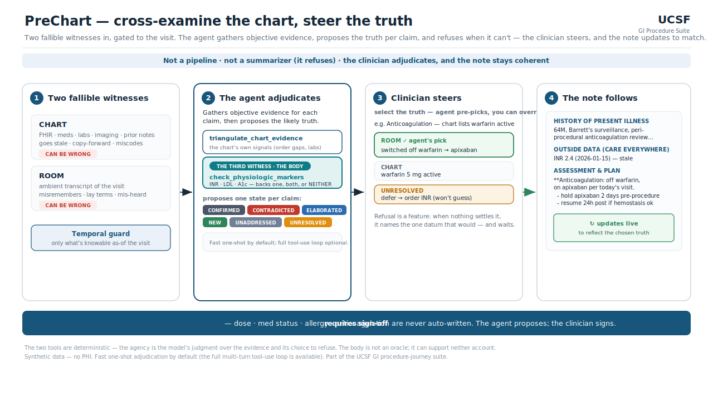

# PreChart

**The chart pre-writes the visit; the ambient conversation cross-examines it — and where the two disagree, an agent investigates instead of guessing.**

PreChart is a pre-charting **verification agent** for the office visit. It drafts the visit from the chart *before* the patient walks in, then reconciles every item against what's actually said in the room. Its founding assumption is what makes it different: **the chart and the conversation are two _fallible_ witnesses** — charts go stale and carry copy-forward/coding errors; patients misremember, use lay terms, and get mis-transcribed — so PreChart trusts neither by default. For each claim it gathers *adjacent, objective* evidence, decides which account that evidence supports, and **refuses to auto-write anything high-stakes**. The clinician signs off.



## Why it's an agent, not a diff or a summarizer

The reconciliation is model-directed judgment a rule can't encode, run as a **bounded tool-use loop** (`adjudicator.py:_run_agent`). For each claim — from *either* side — the model treats it as a hypothesis and decides which tool to call, in what order, and when it has enough:

- **`triangulate_chart_evidence`** — interrogates the chart's *own* internal signals: medication order/refill recency, related-lab corroboration, duplicate therapy, label-only status.
- **`check_physiologic_markers`** — the **third witness**: the body, which neither the chart nor the patient controls (warfarin→INR, statin→LDL, metformin→A1c). It may back one account, both, or **neither**.

If the evidence resolves the claim, PreChart assigns a state and the likely-correct source. If it *doesn't*, it returns **`UNRESOLVED`** with `recommended_next_data` — the single datum that would settle it (e.g. *"order INR today"*) — rather than guessing.

> Not a pipeline (it loops) · not a summarizer (it distrusts its inputs and refuses) · not a workflow (the model directs it).

**States:** `CONFIRMED · CONTRADICTED · ELABORATED · NEW · UNADDRESSED · UNRESOLVED`

## Quickstart

Runs from a single clone — the synthetic dataset is bundled, and the web app + dry-run path use only the Python standard library (no install).

### Web app (the demo)
```bash
python3 app.py                            # → http://localhost:8000
```
Pick one of the 60 patients + a specialty, hit **Run PreChart**, and see the full story on one screen:
**① the pre-charted note** drafted from the chart (specialty-styled, before the room) → **② the ambient
transcript** → **③ the reconciliation** — discrepancies surfaced against the note, the agent's
investigation trace (the tool calls), and its resolution, with the benchmark ground truth as an answer key.
With `ANTHROPIC_API_KEY` set it runs the live agent; without one it runs the dry-run heuristic.

### CLI
```bash
python3 run.py --dry-run                   # stdlib only, no key — placeholder heuristic
pip install -r requirements.txt            # or: uv add anthropic  (for the live agent)
export ANTHROPIC_API_KEY=sk-ant-...        # set this in YOUR shell; never paste keys into code
python3 run.py                             # the real agent; defaults to a warfarin→apixaban case
```
Writes `ledger.html`. Pick any record with `--record-index N` / `--record-id gi-synth-00NN`, and set `--specialty`.

## Specialty configuration

Built for GI, but specialty-agnostic. A specialty config sets the agent's *framing* (what to prioritize for this kind of visit) and which meds/problems are high-significance — it does **not** change the core reconciliation.

```bash
python3 run.py --specialty gi           # default
python3 run.py --specialty cardiology
python3 run.py --specialty hepatology
```

Each specialty also carries an **Epic-style note-format spec** in `specialties/notes/<key>.txt`
that drives the pre-charted note (HPI → Outside Data → A/P, with the physician's exact plain-text
A/P format). Hepatology uses a transplant-hepatology spec; GI and cardiology are domain adaptations;
`_default.txt` is the fallback. Add a specialty by dropping a `specialties/<key>.json` (+ optional
`specialties/notes/<key>.txt`).

## Evaluation

The reconciliation is *scored*, not just demoed. `data/synthetic-gi.jsonl` ships with **367 labeled discrepancies** across 60 patients (`metadata.planted_discrepancies`): stale-chart errors, patient-misremembering errors, and routine controls.

```bash
python3 eval.py --dry-run                 # keyword baseline (no key)
export ANTHROPIC_API_KEY=sk-ant-... ; python3 eval.py   # the real model classifier
```

Reports overall state accuracy, source-of-error accuracy, **stale-chart catch rate**, **patient-error catch rate**, and **false-fire rate on routine controls** (the "don't cry wolf" metric), plus a confusion matrix → `eval-report.md`.

The `--dry-run` baseline is a deliberately weak keyword heuristic (~12% stale-chart catch); it exists to be the floor the agent beats. **Scope caveat, stated plainly:** the eval scores the reconciliation *judgment* given each labeled `chart_state`/`spoken_truth` pair — slightly easier than extracting them from raw FHIR + transcript, which is what the live demo shows end-to-end.

## Temporal integrity

The office visit is one point on a longer timeline (office → prep → procedure → post-procedure). PreChart runs *at* the office visit, so `dataio.redact_future` drops any artifact dated after it — a post-procedure report, path result, or post-op lab can never leak in and let the pre-visit note "know the future." The `as_of` clock is reusable: a downstream agent (e.g. LeftBehind) loads the same record with a later date.

## Safety

Nothing high-stakes (dose, active/inactive medication, allergy, anticoagulation) is ever written automatically — every such change is staged with `requires_signoff`. **The agent proposes; the clinician signs.**

## Layout

| File | Role |
|---|---|
| `models.py` | `Proposal` dataclass + the six states |
| `dataio.py` | load record · extract chart items (with provenance **tier**) + spoken assertions · **temporal filter** |
| `tools.py` | agent tools — `triangulate_chart_evidence`, `check_physiologic_markers`, `find_chart_item` |
| `adjudicator.py` | the agentic core: Claude tool-use loop (live) + `--dry-run` heuristic |
| `note.py` | pre-charts the visit note from the chart (specialty-styled), before the room |
| `run.py` | orchestrate → CLI + `ledger.html` |
| `app.py` + `web/index.html` | the patient-picker web app — note → transcript → reconciliation |
| `eval.py` | score predictions vs the labeled benchmark |
| `specialty.py` + `specialties/*.json` | specialty framing / significance profiles |
| `specialties/notes/*.txt` | per-specialty Epic-style note-format specs (hepatology = transplant) |
| `data/` | 60 synthetic GI records + labels (**fully synthetic — no PHI**) |
| `docs/agentic-loop.svg` | the architecture diagram above |

## Honest caveats

- **`--dry-run` is a placeholder, not the model.** The agent path is the product; don't judge accuracy from the dry-run.
- **Spoken-assertion extraction is keyword-gated** (a recall gap) — a model extractor is the next upgrade.
- **All data is synthetic.** The planted discrepancies are authored so reconciliation can be measured; real charts are messier.
- **"Doesn't ambient AI already do this?"** Ambient tools pull chart context to *write* the note. PreChart uses the conversation to *adjudicate a possibly-stale chart*, weighs a third objective witness, and refuses on high-stakes conflicts. That — two-tier provenance + refusal — is the wedge.

## Suite

Part of the UCSF GI procedure-journey suite: **PreChart** (pre-office) → **FollowThrough** (patient prep) → **NapGuard** (pre-procedure clearance) → **LeftBehind** (post-procedure follow-up). PreChart's reconciled problem/med list is the clean input the downstream agents build on.

*Built for the Abridge × Anthropic × Lightspeed "Future of Agentic AI in Healthcare" hackathon.*
